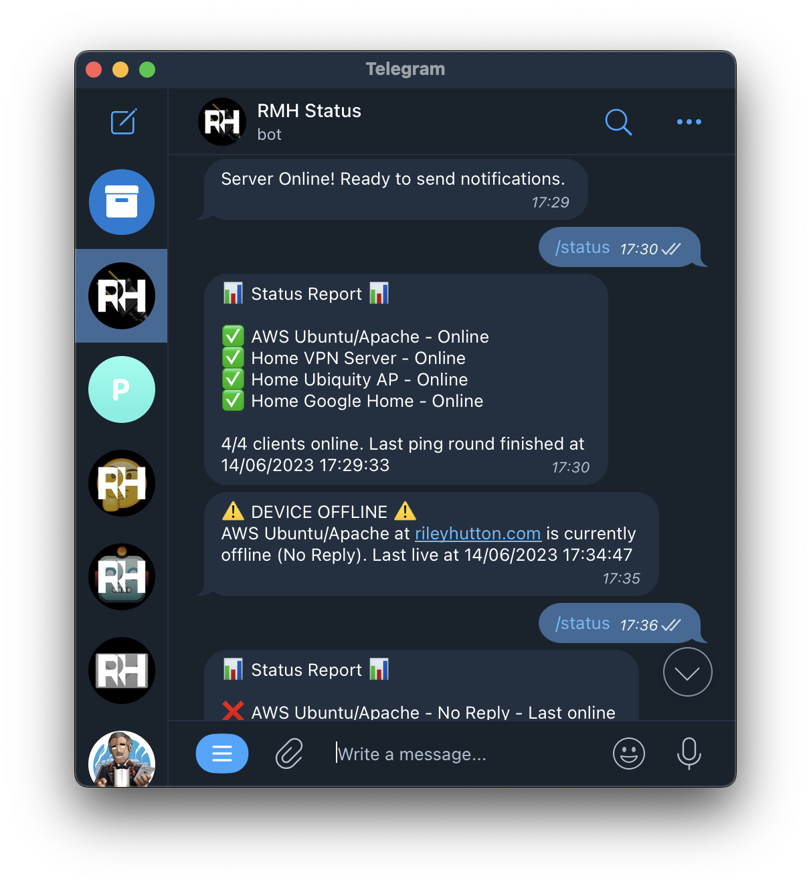
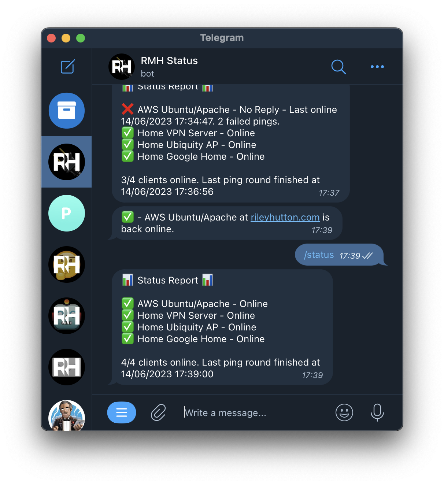

<h1>Telegram Server Status (TS2)</h1>
Recieve alerts via telegram if a device (server, POS terminal, workstation, etc) is offline. Thrown together in an evening to serve a specific purpose and nothing more!

<p float="left">
  
   
</p>

<h2>What does it do?</h2>
<li>Pings a list of ip addresses you define at regular intervals (default 1 min)
<li>Sends all users a telegram message if a device does not respond (or set a number of times for a ping to fail before alerting you)
<li>Sends a list of all devices and their statuses on-demand (by sending /status)

<h2>Instructions</h2>
<li>Clone the github respository, and install dependencies

<code>pip3 install ping3</code><br>
<code>pip3 install requests</code>

<li>Create a telegram bot. Assuming you have a telegram, send <code>/newbot</code> to <code>@BotFather</code>, and give it a name and username. Copy the API key given in the response into <code>telegram-api-key.txt</code>. Keep this key secret!
<li>Send a messagse (eg. <code>/start</code>)to your newly created bot so that it is able to reply to your messages.
<li>Add your Telegram user ID to <code>message-recipients.csv</code> file. You can find this by sending <code>/start</code> to <code>@JsonDumpBot</code> and looking at the first field labelled <code>"id"</code>. (Not "message_id" or "update_id"!)
<li>Add the clients you would like to monitor to the <code>clients.csv</code> file. You should type the name you would like it to be known by, then the ip address or url. Create a new line for each client. Eg:

```
Router, 192.168.0.1
Web Server, example.com
Smart Home Device, 192.168.0.2
Twitter, twitter.com
```
<li>Run <code>server.py</code> with python3!

To run this on startup:
<li>On Windows: Add a shortcut to <code>server.py</code> to your startup folder
<li>On Linux: Add lines to your <code>rc.local</code> file which cd to the directory of <code>server.py</code> and run <code>python3 server.py</code>

<h2>Limitations</h2>
<li>Performance with many recipients not tested - let me know if you have any success with this. No reason it shouldn't work
<li>All clients must be on the same network/VPN or be exposed to the internet if not on the same LAN.

<h2>Troubleshooting</h2>
<li>If dependancies cannnot be found when running from rc.local, try re-installing them with sudo using <code>sudo pip3 install ping3 && sudo pip3 install request</code>
<li>If no pings can get through despite devices being online, run the file with sudo (Linux) or as administrator (Windows)

<h2>Thanks!</h2>
If you'd like to send me an anonymous message, go <a href="https://rileyhutton.com/random/sendme/">here</a> :)
